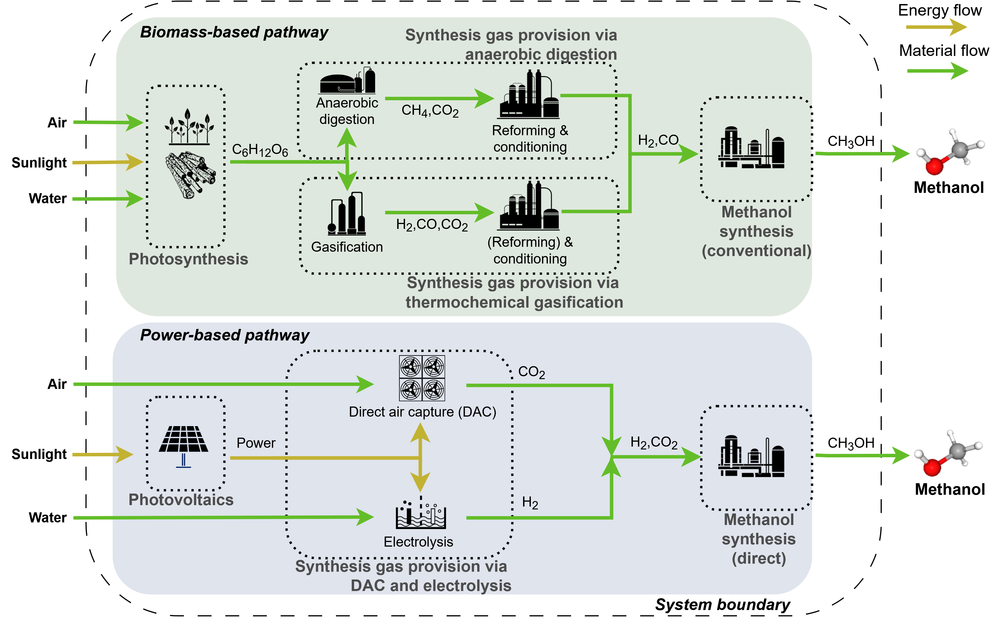

[](https://doi.org/10.5281/zenodo.16884305)

# Solar Energy to Methanol

Code for calculations in the paper: "From solar radiation to green methanol ― An energetic comparison of electricity- and biomass-based provision pathways"



To calculate the theoretical maximum efficiency of:

- photosynthesis
- photovoltaic
- synthesis gas provision via anaerobic digestions of biomass (glucose) and reforming for subsequent methanol synthesis
- synthesis gas provision via biomass (glucose) gasification and reforming for subsequent methanol synthesis
- synthesis gas provision via electrolysis and direct air capture for subsequent direct methanol synthesis
- conventional and direct methanol synthesis

To recreate the results please first make sure you have all dependencies installed.

For this you may use the `environment.yaml` and conda.

```bash
conda env create -f environment.yaml
```

Next, open the [src/workflow.ipynb](./src/workflow.ipynb) jupyter notebook and run it.
This will create all required data and create all python plots.

## Contribution

The following contributed to this code:

- Wolfram Tuschewitzki
- Marvin Scherzinger
- Stefan Bube

Additionally the main part of the Shockley-Queisser limit calculation stems from the [pypi library SQlimit](https://pypi.org/project/sqlimit/) licensed under MIT license. For further information check the extra [README.md](./src/SQLimit/README.md).

## License

This software is licensed under the [MIT license](LICENSE.md).
